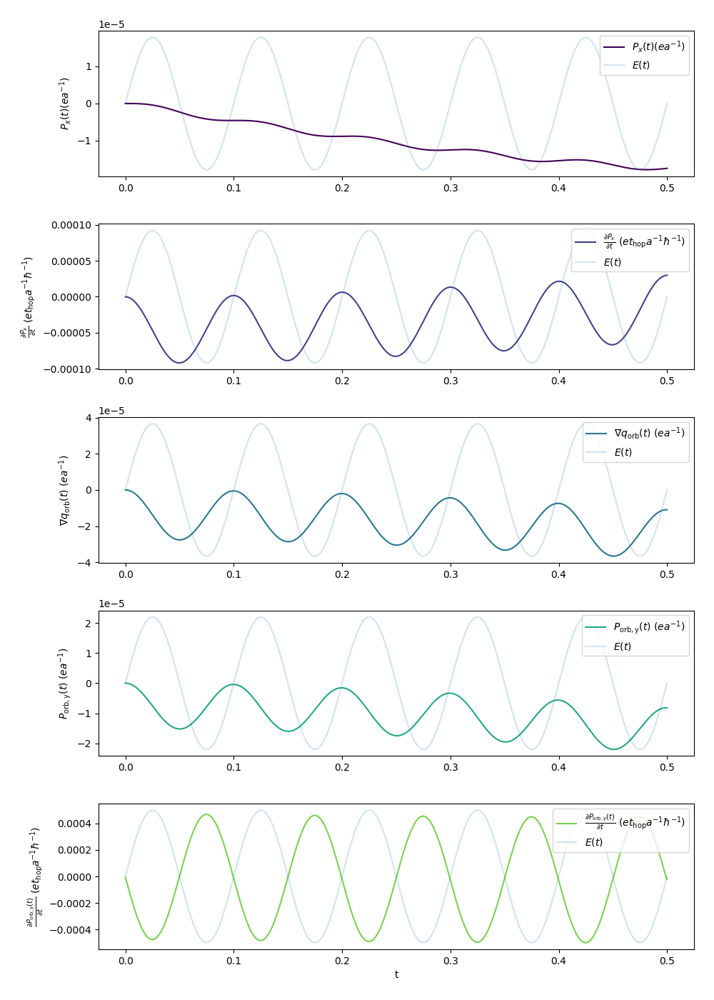
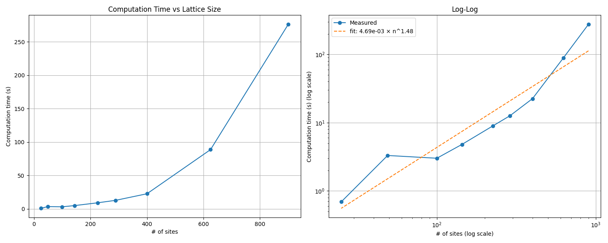

# 2D Tight Binding Simulations
* numerically solve von-Neumann equation for 2D Lattices
* supports Hamiltonians of shape $H_{\rm hop} + E(t) \cdot H_{\rm onsite}$
* $H_{\rm hop}$ has non-zero matrix elements for hoppings along lattice with square/brickwall/hexagonal cells with constant energy $t_{\rm hop}$

## Code Example
```python
import numpy as np
from lattice import Lattice2D, SimulationParameters, BrickwallLatticeGeometry

l = Lattice2D(
    geometry=BrickwallLatticeGeometry((7, 10)), # 7x10 sites, connected brickwall-like
    simulation_parameters=SimulationParameters(
        t_hop=1,                         # hopping energy
        E_amplitude=lambda t: np.sin(t), # driving field with oscillating amplitude
        E_direction=np.array([1, 0]),    # field in x-direction
        h=0.01,                          # time spacing between simulated states
        T=1,                             
        initial_occupation=0.5,      
        substeps=10)
    )
l.evolve(solver="rk4")                   # run simulation
l.save("brickwall_simulation.lattice")
```

## Object-Oriented $\rightarrow$ Extends To Other 2D Geometries
```python
import numpy as np
from lattice import Lattice2D, SimulationParameters, BrickwallLatticeGeometry


class HexagonalLatticeGeometry(BrickwallLatticeGeometry):
    """2D Graphene-like hexagonal structure"""

    def __init__(self, dimensions):
        super().__init__(dimensions)     
        self.row_height = 1.5
        self.col_width = np.sqrt(3) / 2
        self.origin = np.array([(self.Lx-1) * self.col_width, (self.Ly-1) * self.row_height]) / 2

    def site_to_position(self, site_index: int) -> tuple[float, float]:
        """map each site to 2D (x, y) position"""
        row, col = divmod(site_index, self.Lx)
        y_offset = 0.25 * (-1) ** ((col + row) % 2)

        x = self.col_width * (site_index % self.Lx)
        y = self.row_height * row + y_offset

        return x, y

    def cell_field_gradient(self, f: dict[int, float]) -> dict[int, np.ndarray]:
        # TODO
        raise NotImplementedError


l = Lattice2D(HexagonalLatticeGeometry((10, 10)), SimulationParameters(...))
l.evolve(solver="rk4")
l.plot_current_density(-1, auto_normalize=True)
```


*Figure: result of above code snippet, i.e., last state of the simulation.*

## Simulation Examples
### Animations

<table>
  <tr>
    <th>Brickwall Lattice</th>
    <th>Rectangular Lattice</th>
  </tr>
  <tr>
    <td></td>
    <td></td>
  </tr>
  <tr>
    <td></td>
    <td></td>
  </tr>
</table>

### Orbital charge gradient
Average of (discrete) gradients at orbital charge sites behaves very similar to global orbital current.


### Observations
* orbital charge polarisation follows driving field precisely with $\pi/2$ phase shift, currents with $\pi$ shift
* Average gradient of orbital charge and global polarisation yield very similar results. Average difference of normalized series is $\approx 3\,\%$ but seemingly follows beating of the other variables as well

#### Beating
* simulating with constant field yields the "unmodulated" beating (-> no nonlinear response effect of orbital charge?)
* beating frequencies shift with field intensity (-> higher fermi velocities?)
* frequency amplitudes scale with lattice width and lattice height, varying only one dimension affects only some of the beating spectrum
* beating spectrum amplitudes decay $\sim \omega^{-1}$, see plot below


*Figure: result of above code snippet, i.e., last state of the simulation.*

## Accuracy
Resimulating with 10x subdivision and comparing the two resulting polarisation series results in average relative deviations $<10^{-9}$. 

Notes:
1. Simulating with E_{amplitude}=np.sin increased error to $3.8\times10^{-6}$
1. Simulating with half amount of sites decreased error only slightly to $3.2\times10^{-6}$

```python
geometry = BrickwallLatticeGeometry((10, 10))
params = SimulationParameters(t_hop=1.0, E_amplitude=1., E_direction=np.array([0, -1]), h=0.01, T=100, charge=1, initial_occupation=0.5)

l1 = Lattice2D(geometry, params)
l1.evolve(solver="rk4")

params.substeps *= 10

l2 = Lattice2D(geometry, params)
l2.evolve(solver="rk4")

data1 = SimulationData.from_lattice(l1, 1)
data2 = SimulationData.from_lattice(l2, 1)

diff = np.array(data1.P) - np.array(data2.P)
L2_norm = np.linalg.norm(diff) / np.sqrt(len(diff))

print(f"\nAverage relative l2 error: {L2_norm / np.max(np.abs(data1.P))}")
plt.plot(data1.t, diff)
plt.show()
```

*Difference of 10x timestep subdivision against simulation time.*


## Performance
- [not quantitavely tested] rk4 solver (Nithin) could be ~100 times faster while scaling better with system size compared to qutip.mesolve() 
- rk4 time vs # of sites scales well (more testing needed)

